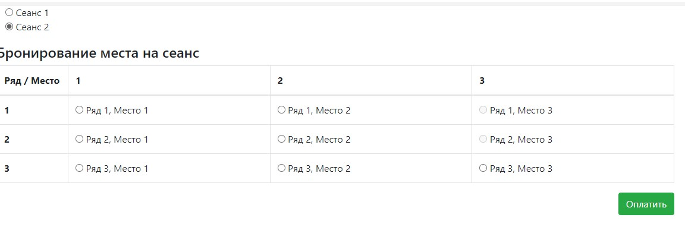
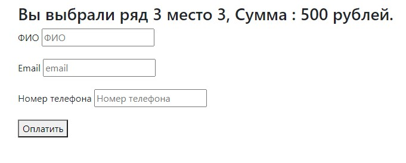

#job4j_cinema
Сервис кинотеатра.
Есть БД из двух таблиц: аккаунты и билеты. В качестве СУБД используется Postgresql.

JS-код вынесен в соответствующие файлы. Для динамической загрузки занятых мест используем AJAX.

Есть две странички: выбор места и сеанса, оплата. На скриншотах представлены окна программы.

